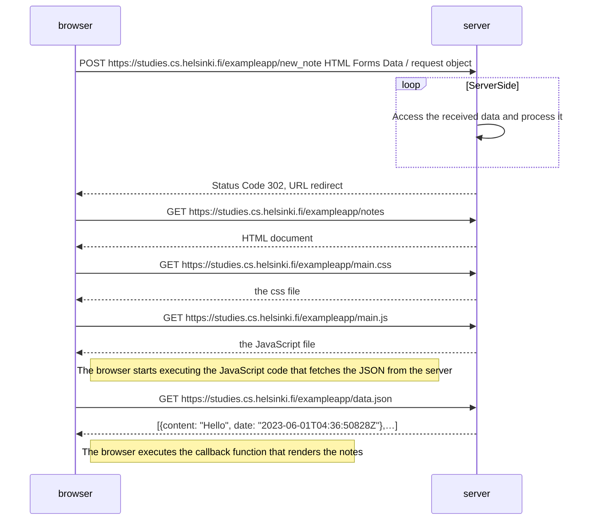

Sequence diagram on creating a new note on the page https://studies.cs.helsinki.fi/exampleapp/notes

```mermaid
sequenceDiagram
participant browser
participant server
browser->>server: POST https://studies.cs.helsinki.fi/exampleapp/new_note HTML Forms Data / request object
loop ServerSide 
    server->>server: Access the received data and process it
end
server-->>browser: Status Code 302, URL redirect

browser->>server: GET https://studies.cs.helsinki.fi/exampleapp/notes
server-->>browser: HTML document

browser->>server: GET https://studies.cs.helsinki.fi/exampleapp/main.css
server-->>browser: the css file

browser->>server: GET https://studies.cs.helsinki.fi/exampleapp/main.js
server-->>browser: the JavaScript file

Note right of browser: The browser starts executing the JavaScript code that fetches the JSON from the server

browser->>server: GET https://studies.cs.helsinki.fi/exampleapp/data.json
server-->>browser: [{content: "Hello", date: "2023-06-01T04:36:50828Z"},…]
Note right of browser: The browser executes the callback function that renders the notes
```