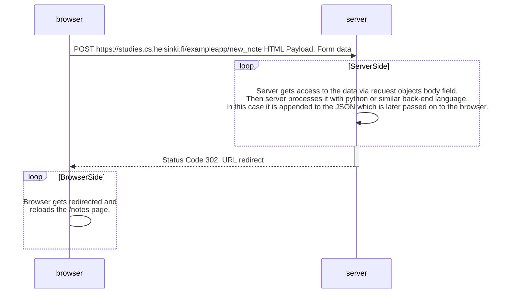

Sequence diagram on creating a new note on the single-app page at https://studies.cs.helsinki.fi/exampleapp/spa

```mermaid
sequenceDiagram
participant browser
participant server

browser->>server: POST https://studies.cs.helsinki.fi/exampleapp/new_note HTML Payload: Form data
loop ServerSide 
    server->>server: Server gets access to the data via request objects body field. <br> Then server processes it with python or similar back-end language. <br> In this case it is appended to the JSON which is later passed on to the browser.
end
activate server
server-->>browser: Status Code 302, URL redirect
deactivate server
loop BrowserSide
    browser->browser: Browser gets redirected and <br> reloads the /notes page.
end


```