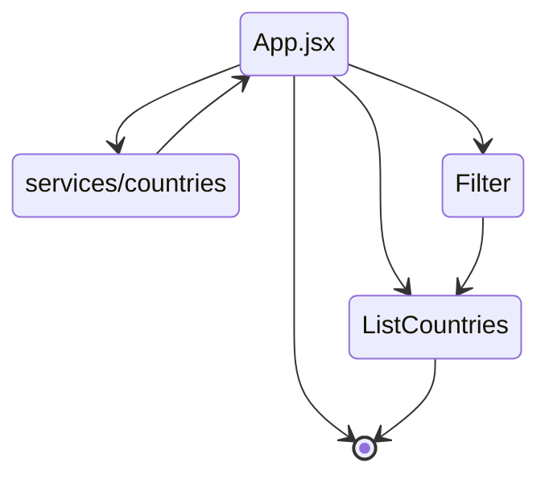

# Fullstack Open
## Part2 Countries

The React exercises are done using [Vitejs](https://vitejs.dev/guide/)

### Planing the app
<pre>
src
    components
        Filter
        ListCountries
        ShowCountry
    services
        countries
    App.jsx
    main.jsx
    main.css
</pre>

